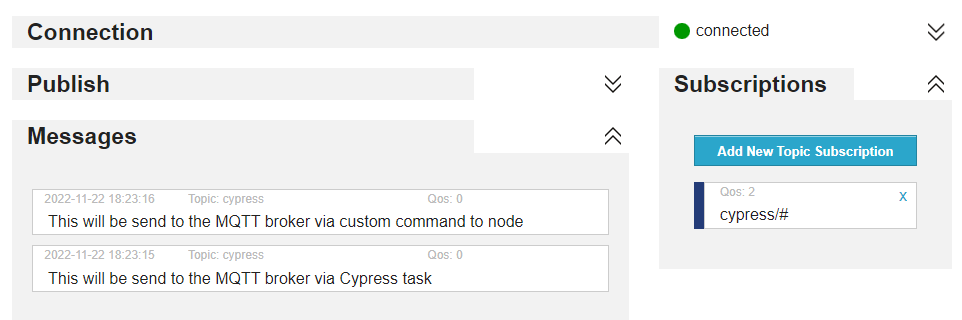

# Cypress MQTT Sample

- [Cypress MQTT Sample](#cypress-mqtt-sample)
  - [Install](#install)
  - [Usage](#usage)

This is a proof-of-concept for sending MQTT data to a MQTT server inside a Cypress test.\
In this example http://www.hivemq.com/ is used, but should work with others as well.


## Install

```shell
$ npm install
```

## Usage

```shell
$ npm run test
```

* Visit [HiveMQ](http://www.hivemq.com/demos/websocket-client/) and connect
* Add new topic subscription: `cypress`
* Run the `mqtt.cy.ts` test inside Cypress
* Check the messages in HiveMQ



There are 2 ways to send messages:
* Usage of a Cypress task (see `cypress.config.ts`)
* Usage of a custom Cypress command (see `cypress\support\commands\mqtt.ts`), that triggers a npm script
* both do basically the same thing
